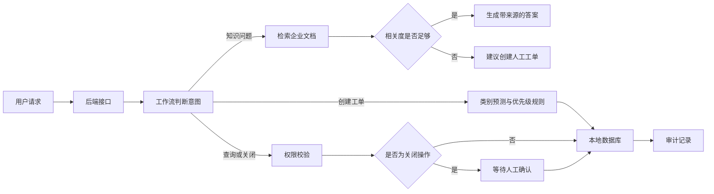

# 企业知识库与智能工单助手

一个可在本地运行的人工智能应用项目：用户提出企业制度问题时，系统先检索知识文档并返回带来源的答案；遇到知识库无法覆盖的问题时，可以创建工单，并自动完成类别预测、优先级判断、权限校验、人工确认与审计记录。

> 项目定位：用于展示“数据处理 → 模型训练 → 知识检索 → 工作流编排 → 后端接口 → 网页演示 → 自动评测”的完整工程流程。当前使用小规模合成数据与离线证据回答，评测结果不代表真实生产环境效果。

## 核心能力

- **有依据的知识问答**：从企业文档中检索相关段落，答案附带来源；没有足够依据时拒绝编造。
- **工单自动分类**：使用机器学习模型，将问题分为制度咨询、技术问题、支付问题和账号问题。
- **可控制的工作流**：支持创建、查询和关闭工单；关闭操作必须经过明确的人工确认。
- **权限与审计**：普通用户只能访问自己的工单，关键操作写入审计日志。
- **异常处理**：包含输入校验、数据库有限重试和在线模型失败后的离线回退。
- **可视化演示**：提供响应式网页和自动生成的交互式接口文档。

## 系统流程



这里的“工作流”是把一个任务拆成多个有顺序、有条件的处理步骤；“审计记录”是记录谁在什么时间执行了什么关键操作，方便追踪问题。

## 已验证结果

| 检查项目 | 本地结果 | 说明 |
|---|---:|---|
| 工单分类准确率 | 96.7% | 30 条合成测试样本；简单基准为 23.3% |
| 知识检索首位命中 | 16 / 16 | 小型开发问题集 |
| 知识库外问题正确拒绝 | 4 / 4 | 无可靠依据时不生成答案 |
| 自动测试 | 37 / 37 | 覆盖数据、模型、检索、工作流与接口 |
| 后端接口场景 | 6 / 6 | 包含权限拒绝、人工确认和输入校验 |

详细报告：

- [工单分类评测](reports/step04_model_evaluation.md)
- [知识检索评测](reports/step05_retrieval_evaluation.md)
- [端到端回答评测](reports/step05_answer_evaluation.md)
- [工作流评测](reports/step06_workflow_evaluation.md)
- [后端接口评测](reports/step07_api_evaluation.md)

## 技术选择

| 模块 | 使用技术 | 作用 |
|---|---|---|
| 编程语言 | Python 3.12 | 实现数据处理、模型、工作流和后端服务 |
| 数据处理 | Pandas、NumPy | 清洗、检查和统计工单数据 |
| 工单分类 | scikit-learn | 训练并保存文本分类模型 |
| 知识检索 | 词频—逆文档频率与余弦相似度 | 把问题与文档段落进行相关度匹配 |
| 后端服务 | FastAPI、Uvicorn | 提供网页和超文本传输协议接口 |
| 数据存储 | SQLite | 保存工单和审计记录 |
| 网页界面 | HTML、CSS、JavaScript | 提供可操作的演示页面 |
| 自动测试 | Python 内置 unittest、FastAPI 测试客户端 | 验证正常、边界、异常和权限场景 |

“词频—逆文档频率”是一种把文本转换成数字特征的方法：某个词在当前文本中常见、但在所有文本中不常见时，它会获得更高权重。“余弦相似度”用于比较两组文本特征的方向是否接近。

## 快速运行

### 1. 准备环境

建议把仓库克隆到非系统盘。下面以 Windows PowerShell 为例：

```powershell
git clone https://github.com/WMXS855/enterprise-ai-ticket-assistant.git
Set-Location .\enterprise-ai-ticket-assistant
python -m venv .venv
.\.venv\Scripts\python.exe -m pip install -r requirements.txt
```

“虚拟环境”是项目独立的 Python 运行空间，可以避免不同项目的依赖版本互相冲突。如果仓库放在 D 盘，上述虚拟环境也会保存在 D 盘项目目录中。

### 2. 启动演示

```powershell
.\.venv\Scripts\python.exe -B -X utf8 -m uvicorn src.api:app --host 127.0.0.1 --port 8000
```

浏览器打开：

- 演示首页：`http://127.0.0.1:8000/`
- 交互式接口文档：`http://127.0.0.1:8000/docs`

也可以在 Windows 中双击 `start_demo.bat`。按 `Ctrl + C` 停止服务。

### 3. 运行自动测试

```powershell
.\.venv\Scripts\python.exe -B -X utf8 -m unittest discover -s tests -v
```

## 推荐演示路径

1. 在“知识问答”中询问“一线城市住宿上限是多少”，展示答案和文档来源。
2. 询问知识库外的问题，展示系统拒绝编造并建议转人工。
3. 创建“员工无法登录内部系统”工单，展示类别和优先级判断。
4. 使用其他用户编号查询工单，展示越权访问被拒绝。
5. 尝试关闭工单，展示系统先暂停；勾选人工确认后再次关闭。
6. 打开交互式接口文档，说明输入校验和返回状态。

## 项目结构

```text
ai-ticket-assistant/
├─ data/          # 原始数据、清洗后数据和评测问题
├─ docs/          # 项目概览、技术设计和配置说明
├─ knowledge/     # 企业知识文档
├─ models/        # 已训练的工单分类模型
├─ reports/       # 模型、检索、工作流和接口评测报告
├─ src/           # 后端、模型、检索、数据库与工作流代码
├─ tests/         # 自动测试
├─ web/           # 网页界面
└─ start_demo.bat # Windows 一键启动脚本
```

## 安全设计

- 密钥通过本地环境变量读取，不写进代码；`.env` 文件已被 Git 忽略。
- 知识库无可靠依据时拒绝回答，降低编造信息的风险。
- 关闭工单必须人工确认，模型不能直接执行高影响操作。
- 数据库使用参数化查询，避免用户输入被当成数据库命令。
- 普通用户只能查看和关闭自己的工单。
- 创建和关闭操作写入审计日志。

## 当前边界与后续计划

- 当前用户编号和角色由请求参数模拟，不是真实登录认证。
- 当前分类数据和评测问题为小规模合成数据，不能代表真实业务分布。
- 当前知识问答默认使用离线证据回答；在线大语言模型适配器已实现，但尚未使用个人密钥完成真实调用验证。
- 当前使用本地 SQLite 数据库，未进行生产环境并发和负载测试。
- 当前检索方式适合小型知识库，尚未接入向量数据库、语义向量模型和重排序模型。
- 下一步可加入真实身份认证、脱敏业务数据、独立测试集、容器化部署和线上监控。

## 技术文档

- [项目概览](docs/project_overview.md)
- [技术设计与代码导读](docs/technical_design_and_code_guide.md)
- [在线模型配置说明](docs/online_model_setup.md)
- [技术名词解释](docs/glossary.md)
